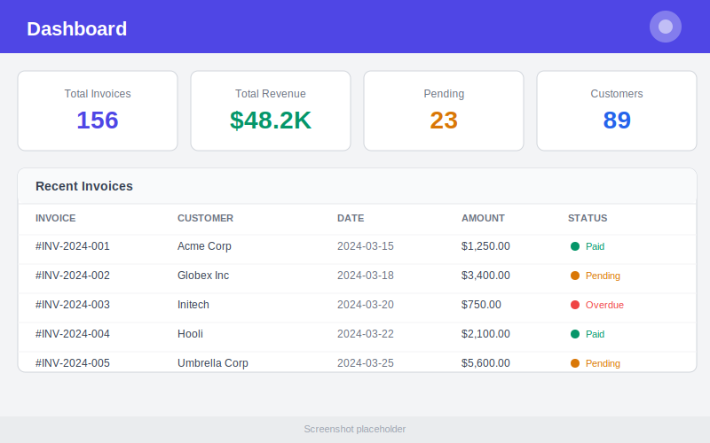
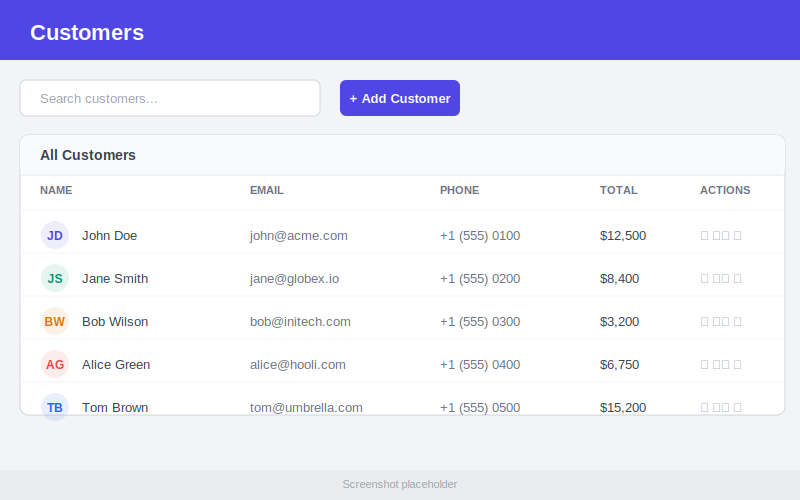
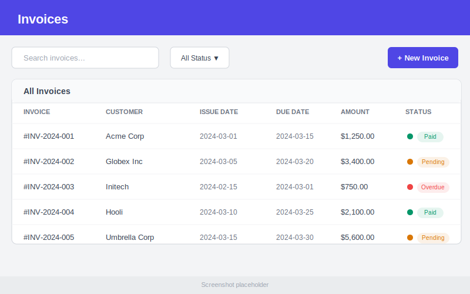
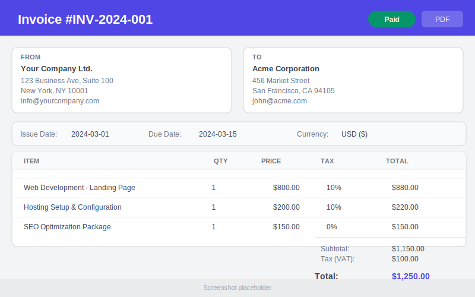
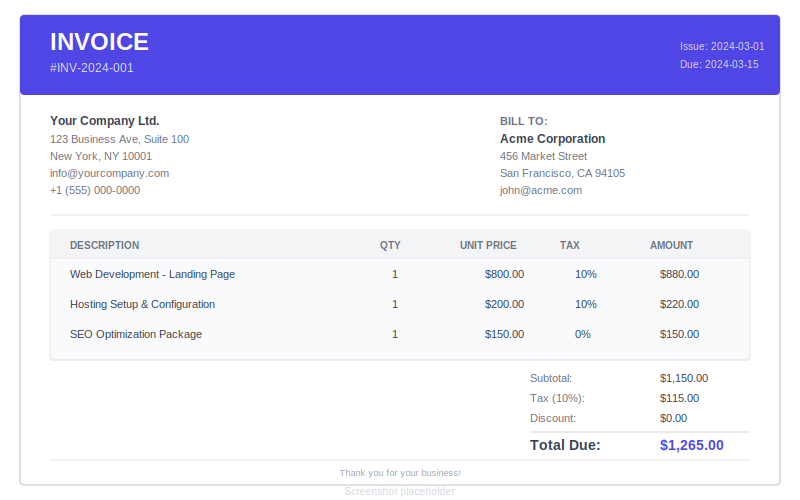
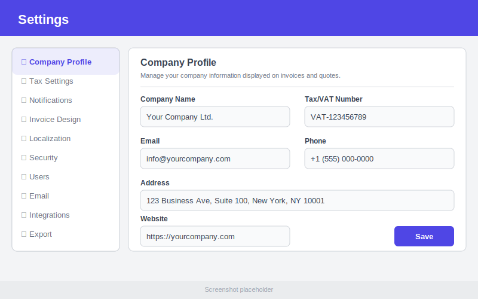

<p align="center">
  
  
  
  
  
  
  
</p>

# Open Invoice Manager

Free, open-source, self-hosted invoice and quote management application for freelancers and small businesses. Built with Laravel.

**Repository:** [github.com/mchtylmz/open-invoice-manager](https://github.com/mchtylmz/open-invoice-manager)

**Author:** [LinkedIn](https://www.linkedin.com/in/mmucahityilmazz/)

## Features

- Customer management (CRUD)
- Product/service catalog
- Quote creation with PDF export
- Invoice creation with PDF export
- Tax/VAT settings
- Multi-currency support
- Payment status tracking
- Company profile settings
- Dashboard with statistics
- Search and filtering
- Docker support
- Demo data seeder

## Tech Stack

- **Laravel** (latest stable)
- **Livewire**
- **TailwindCSS**
- **MySQL / MariaDB**
- **Redis**
- **DomPDF**

## Installation

### Docker (Recommended)

```bash
docker-compose up -d
docker-compose exec app php artisan migrate --seed
```

Access at http://localhost:8080

### Manual Installation

```bash
cp .env.example .env
# Edit .env with your database credentials
composer install
npm install && npm run build
php artisan key:generate
php artisan migrate --seed
php artisan serve
```

### Demo Credentials

- **Email:** admin@example.com
- **Password:** password

## Screenshots

| Dashboard | Customers |
|:---------:|:---------:|
|  |  |

| Invoices | Invoice Detail |
|:--------:|:--------------:|
|  |  |

| Invoice PDF | Settings |
|:-----------:|:--------:|
|  |  |

## PDF Export

Invoices and quotes can be exported as PDF from their detail pages. The export uses DomPDF and produces print-friendly layouts.

## License

MIT
